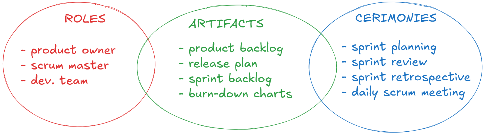
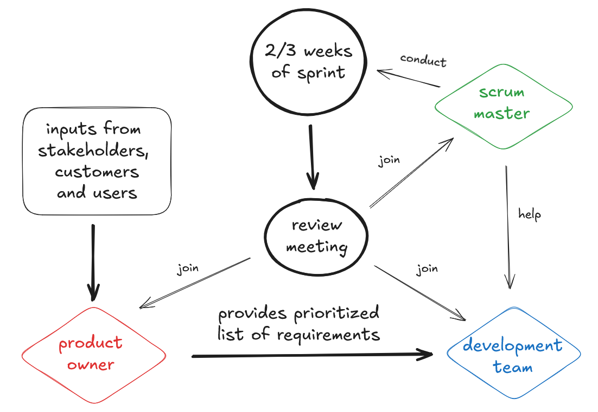

# Scrum Methodology

author: *Sakshi Sachdeva*

---

## Introduction

scrum is an incremental and iterative agile software development framework for managing product development. 

> "a flexible, holistic product development strategy where a development team work as a unit to reach a common goal"

🗝️: requirements volatility ("custormers can change their meinds during production")

its empirical, accepts that the problem cant be fully defined.

requires specialized teams capable of self-management, communication and decision-making. 

#### qual o molho do scrum, que deixe ele tãaaaao poggers?

since scrum does not explicity describe any engineering practices, it is possible to consider non-scrum practices that can be linked to the process, so scrum can always be mixed with other techniques (like Extreme Programming - common use).

scrum provides feedback!!! this is given to improve the results. 

using it correctly means following its rules, which expose everything (transparently) for inspection and adaptation.

---

## PO, SM & Team

#### scrum practices and roles

with scrum, the product is built in a series of fixed-length iterations called **sprints**. sprints are cycles which the product is built and is delivered for feedback. this cycles brings the feeling of progress continuosly and helps find out the misunderstood requirements at a early stage.

only the Product Owner has authority to cancel the sprint. 

**Product Owner (PO)**: is responsible for the vision of the product, the gathering and the priorization of the requirements, control over the budget and the ROI (Return Of Investment).

**Scrum Master**: takes care of the problems, the following of scrum's rules and of coaching the team. 

**Team**: self-organized group that is responsible for the creation and the quality of the product, is a cross-functional (includes testers, designers, devs and ops engineers). 

#### product owner description

PO is a mediator between the team and stakeholders. they ensure that the team delivers the most value to the business. its better to be just one person. 

PO functions:
- build and manage the product backlog
- sets the priority for each item in the product backlog
- work closely and communicate well with the business and the team to ensure everyone understands the work items 
- guidance on which feature to deliver next

being a PO means:
- you are responsible for the success of the outcome of the product delivered by the team
- you are the "business man"
- you deliver the vision of the product to the team
- you prepare the User Stories
- you validate the product against the user's expectation and test for its quality
- you communicate with everyone (stakeholders, financiers and team)

#### scrum master description

in same cases, can has a product manager and a scrum master together (but they are not the same thing).

SM definitions:
- an effective scrum master deeply understands the work beign done and can help to optimize their delivery flow
- as the facilitator-in-chief, they schedule the need resources for sprint planning, stand-up, sprint review...
- sm look into the impediments and distractions for the development team and resolve them
- is who observes that the team obeys the rules and realizes the method of scrum entirely. 
- they dont interfere into the decisions of the team about the development

scrum master has to get rid of all possible impediments that disturb the work of the team or slow down the sprint. this problems can be classified as:

1) problems that the team cant solve. ex.: the team cant do any kind of performance-tests because the hardware is not in place. 

2) from the organizational structure or strategic decisions. maybe the office is not capable of handling the important meetings or teamwork.

3) individuals within the team needs a hand with debugging. 

its commons to misunderstand the position of the scrum master in a project, he is commonly seen as the responsible for the team members, like a project leader.

#### development team description

teams are cross functional and help each other to deliver the work in time. strong teams approach their project with a clear "we" attitude. agile teams pulls a certains amount of work off the backlog and commits to completing it that sprint. there isnt a push of work (from PO or SM) to the team, the self team does this pull move.

team details:
- the team decides which requirements or User Stories it can accomplish in one sprint
- the self team becomes a manager

---

## Scrum Artifacts

#### product backlog

- it is the master list of all functionality desired in the product
- managed by PO
- changes as fits to product owner and buisiness value

#### release plan

it describes:
-  the goal of the release
- the highest priority items in product backlog
- the major risks
- overall features 
- functionality that the release will contain

#### sprint backlog

its the output of the Sprint Planning Meeting
- has the tasks for the sprint derived from product backlog by breaking stories into tasks
- owned and modified by the team

#### burn-down charts

visual artifcats, visible to the team and spectators alike, act as motivators
- create a spirit of "we're doing this"
- having the opportunity to show off new work at the sprint demo is motivating and with the feedback from stakeholders helps the development

#### scrum ceremonies

scrum calls for four ceremonies:
- sprint plannig
- sprint review
- sprint retrospective
- daily scrum meeting

#### sprint planning

- duration: eight hours (for a one month sprint)
- determines what will be done in the sprint and how the team is going to build the product increment during the sprint

#### sprint review

- duration: two hours ~ four hours (one month sprint)
- it is held at the end of a sprint where the team presents to the PO and stakeholders
- team demonstrate and discuss the work done
- PO gives a feedback
- inputs for next sprint

#### sprint retrospective

- duration: one ~ two hours
- team and PO attend
- discuss what went well, what require improvement and what is not working

#### daily scrum meeting

- time boxed to 15min
- used only for the team
- other stakehoders may join but stays mute
- each team member explain what they done since the last daily, what is going to do before the next one and what obstacles are in their way
- update task progress on tool/visual board